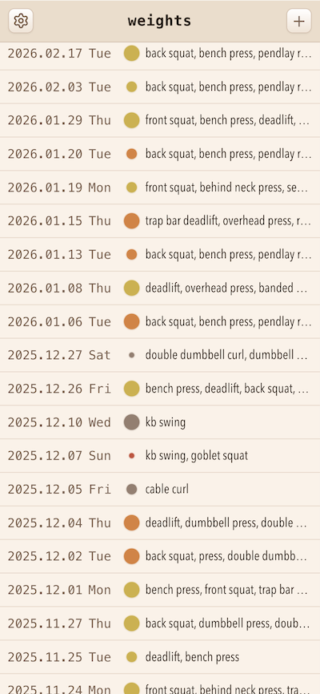
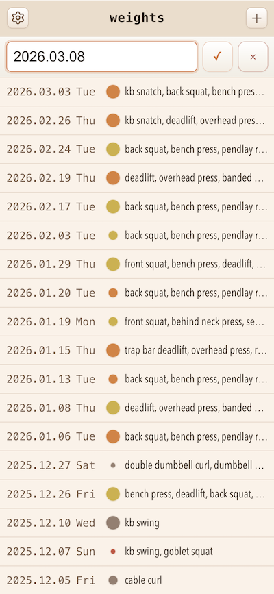
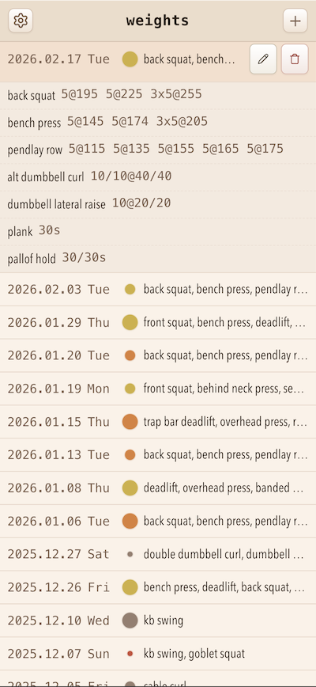
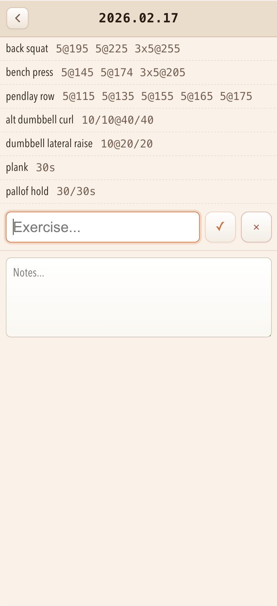
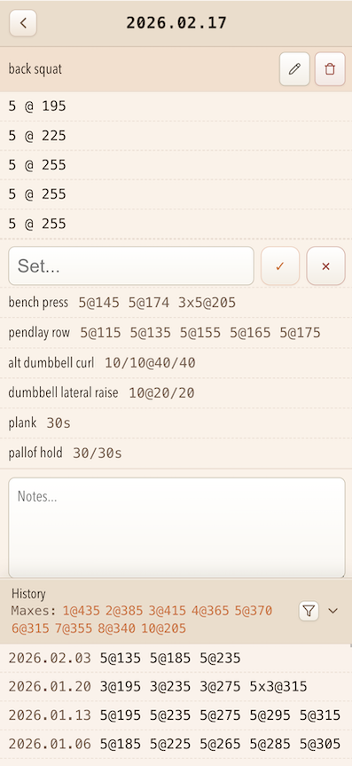

# Weights UI Tour

This is a quick visual guide to the main screens in the app.

## Workout List

This is the main screen. Each row shows the workout date, day of week, a volume/intensity marker, and the exercise summary.

- Tap a workout row to expand or collapse its exercise details.
- Tap the pencil on the current row to open that workout.
- Tap delete to remove a workout.
- Use the marker as a quick scan: size = volume, color = intensity, gray = volume only.

## Create Workout

This is the inline add-workout flow on the main screen. Enter the date first, then add exercises as a comma-separated list.

- Type a line like `2026.03.09 bench press, deadlift`.
- Autocomplete follows the current comma-separated exercise chunk near the cursor.
- Submitting creates the workout immediately.
- If the new workout includes exercises, the workout opens and the first exercise is ready for set entry.

## View Workout

This is the workout screen. It shows the exercise list, each exercise's set summary, the add-exercise field, and workout notes at the bottom.

- Tap an exercise to make it current and expand its sets.
- Tap the add-exercise field to clear the current exercise and return to workout-level entry.
- Add sets from the set field under the expanded exercise.
- Tap the notes field to collapse exercises and clear selection before writing notes.

## Edit Workout

Editing happens inline instead of in a modal. Current exercises and sets expose their edit controls directly in the list.

- Current exercises show edit and delete buttons.
- Tapping a set makes it current and opens inline editing for reps/weight.
- Set edits save as you type.
- Current sets also show the RPE dropdown and delete button.

## History

The history drawer gives context for the currently selected exercise inside a workout.

- Open it from the workout screen when an exercise is current.
- Review prior sessions for that exercise without leaving the workout.
- Use the reps and weight filters to narrow the history.
- Use the max buttons to jump to notable entries quickly.
